# Vibe Coding Agent 项目分析

沙箱 Web 开发 Agent：自然语言生成或修改可部署到 EdgeOne Makers 的 Web 项目，带实时预览、文件浏览和一键发布。

分析对象：本仓库源码 · 2026-08-30 · 图均为 Mermaid。

正文按阅读路径排：先看事件和传输，再进模型。第 1–3 节建全局图；第 4–6 节是契约、任务槽、SSE；第 7 节是 pipeline（何时进模型）；第 8 节是生成内部（含 `query()`）；第 9 节是工具面；第 10–11 节是前端与预览。

---

## 目录

1. [它是什么](#1-它是什么)
2. [仓库目录与分层](#2-仓库目录与分层)
3. [全局调用与一轮时序](#3-全局调用与一轮时序)
4. [`shared/`：契约](#4-shared契约)
5. [任务槽：从创建到回收](#5-任务槽从创建到回收)
6. [SSE 传输](#6-sse-传输)
7. [`pipelines/` 模块](#7-pipelines-模块)
8. [生成内部](#8-生成内部) — [8.2 `query()`](#82-query模型主循环) — [8.3 `runCodingAgent`](#83-runcodingagent)
9. [模型与工具](#9-模型与工具) — [9.1 Prompt 怎么管理](#91-prompt-怎么管理)
10. [`app/`：工作区 UI](#10-app工作区-ui)
11. [预览与部署](#11-预览与部署)

---

## 1. 它是什么

每个会话对应沙箱目录 `projects/<conversationId>/app`。模型通过受限 MCP 工具写文件、跑命令；**宿主**负责恢复工作区、兼容性 lint、构建校验、预览网关和凭证。部署是独立任务，不经过模型，但和生成共用同一任务槽，避免抢沙箱。

| 层 | 目录 / 来源 | 职责 |
|---|---|---|
| 浏览器工作区 | `app/` | 对话、文件树、预览 iframe、一键发布；只 `fetch`，不 import `agents/` |
| 传输契约 | `shared/` | SSE 事件类型、CLI 解析、文件徽标；零 React / Next / SDK |
| Agent 运行时 | `agents/` | 路由、任务槽、Pipeline、SDK 循环、工具、沙箱逻辑 |
| 模型循环 | `@anthropic-ai/claude-agent-sdk` | 仅 `query()` / MCP / Skill；见第 8.2 节 |
| 平台 | EdgeOne Makers | 会话亲和、sandbox、`context.store`、`toClaudeMcpServer`、Blob |
| 知识 | `.claude/skills/` | vendored Makers 文档，按需 `load_makers_skill` |

`edgeone.json`：`agents.framework = claude-agent-sdk`，Agent 与沙箱超时均为 1800s。默认模型 `@makers/deepseek-v4-flash`。

三块代码边界由 `tests/architecture.test.ts` 钉死：`app/` 不得引用 `agents/`；`shared/` 不得依赖 React / Next / `@anthropic-ai`；`agents/pipelines|project|tools|utils` 下文件名必须以下划线开头，否则会被 Makers 扫成公开路由。

---

## 2. 仓库目录与分层

```text
vibe-coding-agent/
├── app/                      # Next.js 工作区 UI
│   ├── page.tsx              # 服务端壳，只挂 WorkspaceScreen
│   ├── features/workspace/   # 总控、API、SSE、header / home / deploy
│   ├── components/           # 对话时间线、文件面板
│   ├── lib/                  # conversation、timeline、tool 展示
│   └── hooks/                # 文件缓存、占位打字
├── agents/                   # Makers Agent 运行时
│   ├── chat.ts 等            # 无下划线 = 公开 HTTP 路由
│   ├── _agent.ts / _shared.ts # 下划线 = 私有；`_shared` 是 SSE 帧
│   ├── pipelines/            # 回合编排
│   ├── project/              # 沙箱 FS / 预览 / token
│   ├── tools/                # 模型可见的自定义 MCP 工具
│   └── utils/
├── shared/                   # 前后端共用纯函数（10 个模块）
├── tests/                    # 28 个 node:test
├── .claude/skills/           # 45 篇 vendored Makers 文档
├── edgeone.json
└── docs/
```

调用方向永远是：`app/` fetch → `agents/` 公开路由 → 任务槽 → pipeline →（仅生成）SDK → 工具 → 沙箱。`shared/` 被两端 import，不出现在这条调用链中间。

---

## 3. 全局调用与一轮时序

### 3.1 模块如何连在一起

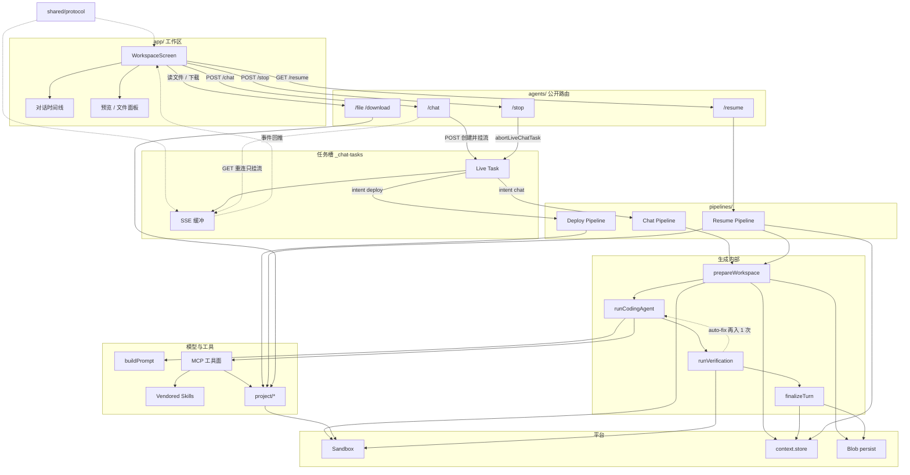

实线：同步调用。虚线：SSE 回推，或校验失败后 auto-fix 再进 `runCodingAgent`（最多 1 次）。生成内部的真实顺序是 prepare → agent → verify → finalize；`finalizeTurn` 是出口提交，不是生成前的准备。Deploy 不经过 `runCodingAgent`，因此也不经过 SDK。

### 3.2 「做个留言板」时序

```mermaid
sequenceDiagram
  actor User
  participant UI as WorkspaceScreen
  participant Chat as POST /chat
  participant Task as Live Task
  participant Pipe as runChatPipeline
  participant Agent as runCodingAgent
  participant SDK as claude-agent-sdk query
  participant MCP as MCP tools
  participant Box as Sandbox
  participant SSE as SSE 缓冲

  User->>UI: 做个留言板
  UI->>Chat: message + turnId
  Chat->>Task: createChatTask 并挂流
  Task->>Pipe: intent=chat
  Pipe->>Box: prepareWorkspace / restore
  Pipe->>Agent: runCodingAgent
  Agent->>SDK: query()
  SDK->>MCP: scaffold / write / commands
  MCP->>Box: 写文件 / makers dev
  MCP-->>Pipe: preview_ready
  Pipe-->>SSE: tool_use / file_content
  SSE-->>UI: 时间线 + 文件 + iframe
  Pipe->>Box: runVerification
  alt build 失败
    Pipe->>Agent: auto-fix 再跑一轮 query()
  end
  Pipe->>Task: result
  Task-->>UI: 终回复 + build
```

刷新不断生成：HTTP 的 `request.signal` 被换成任务自己的 `AbortController`。只有 `POST /stop` → `abortLiveChatTask` 会停 `query()`。SSE 两条流怎么接，见第 6 节。

---

## 4. `shared/`：契约

不得 import `react` / `next` / `@anthropic-ai` / `../app` / `../agents`。前后端和测试共用同一份逻辑，避免「服务端一种解析、前端另一种」。

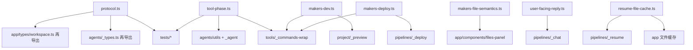

| 文件 | 谁用 | 做什么 |
|---|---|---|
| `protocol.ts` | 两端 | `ChatStreamEvent`、`ResumeStreamEvent`、`DeploymentInfo`、`FileTree`、`AssistantActivity` |
| `tool-phase.ts` | agent + wrapper | 缩短 MCP 名；识别 install / preview / makers dev·deploy；`MAKERS_CLI_UNAVAILABLE` |
| `makers-dev.ts` | wrapper + preview | 后台 `makers dev`、3000 剥前缀代理、`/preview` 308 到 `/preview/` 且保留 query、退出码 marker |
| `makers-deploy.ts` | wrapper + deploy | `deploy --json` 解析 URL / projectId / deploymentId、脱敏 |
| `makers-file-semantics.ts` | Files 面板 | `agents/` → AI；cloud-functions → API；edge → EDGE；middleware → MW；`[id]` → `:id` |
| `user-facing-reply.ts` | pipeline | 终回复压成一两句；单独拼回线上 URL |
| `sanitize-assistant-text.ts` | memory + agent | 写回 history 前去掉控制序列 |
| `resume-file-cache.ts` | resume + 前端 | 恢复最多 48 文件 / 合计 2MiB / 单文件 256KiB；优先 `package.json`、`index.html` |
| `conversation-export.ts` | transcript | 导出文件名 |
| `sandbox-command.ts` | 命令分类 | 与 tool-phase 配合 |

`protocol.ts` 只定义事件**形状**：Chat 侧是 `task_started` / `status` / `text_segment` / `tool_*` / `file_*` / `preview_ready` / `deployment_status` / `agent` / `result` / `error` / `ping` / `log`；Resume 侧是 `resume_history` / `resume_workspace` / `resume_file_content`。谁推、谁缓冲、谁解析，见第 6 节。

---

## 5. 任务槽：从创建到回收

文件：`agents/_chat-tasks.ts`。入口：`agents/chat.ts`（极薄路由）。停止：`agents/stop.ts`。

这一节概括任务的**实现和管理**：创建、占槽、执行、投递、终态、停止、回收。槽不管「这一轮写哪些文件」——那是 pipeline 的事。它只保证一轮 `query()` / `makers deploy` 能活过多次 HTTP，且一个会话同一时刻只有一个任务碰沙箱。帧格式见第 6 节。

生成可以到 1800s。若把 pipeline 绑在 `POST /chat` 的 `request.signal` 上，刷新一关 SSE，模型和沙箱命令一起死；再 POST 又开一轮，两套逻辑抢文件。所以拆成占槽、执行、投递三件事，生命周期如下。

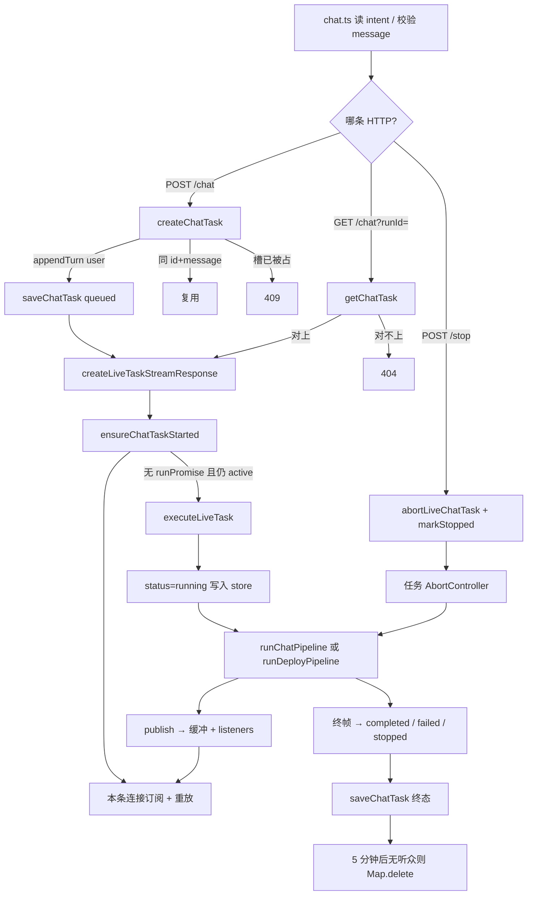

`chat.ts` 只读 `intent`（`chat` | `deploy`）、校验 message、转给槽。空消息且非 deploy → 400。deploy 且空消息 → 填 `Deploy this project`。POST 同时占槽 + 挂流；GET 只挂流。Chat 和 Deploy 共用槽（`tests/deploy-task.test.ts`）；Resume / 读文件 / 导出不占槽。

状态机：`queued` → `running` → `completed` / `failed` / `stopped`。只有前两态占槽（`isTaskActive`）。

槽在进程里拆成两块：`LiveChatTask`（`runPromise` + 独立 `AbortController` + `publish`）和同一对象上的事件缓冲 / listeners。下面按生命周期下钻。

### 5.1 两份状态，谁在管

| | 耐久 `ChatTask` | 进程内 `LiveChatTask` |
|---|---|---|
| 存在哪 | `context.store` 的 conversation `metadata.chatTask` | 模块级 `liveTasks` `Map` |
| 键 | 每个 conversation 一份（覆盖写） | `` `${conversationId}:${taskId}` `` |
| 活过进程重启 | 能 | 不能 |
| 里面有什么 | id / message / intent / status / 时间戳 / `finalEvent` | 上面那份 task 的副本 + 事件缓冲 + listeners + AbortController + `runPromise` |
| 谁读写 | `getChatTask` / `saveChatTask`（`agents/_memory.ts`） | `getOrCreateLiveTask` / `publish` / `ensureChatTaskStarted` |

事件日志不是真相源：缓冲只为短时重放。耐久状态和终结果在 store。冷启动怎么接上，见第 5.5 节。

`ChatTask` 字段（`agents/_types.ts`）：

| 字段 | 含义 |
|---|---|
| `id` | 前端传入的 `turnId`，缺省则 `crypto.randomUUID()` |
| `message` | 用户原文；deploy 且空消息时已在路由层填过默认句 |
| `intent` | 缺省当 `chat`；`'deploy'` 跳过模型 |
| `resetProject` | 首页新开会话为 true |
| `status` | `queued` → `running` → `completed` / `failed` / `stopped` |
| `finalEvent` | 终帧快照，给晚到的重连直接重放 |
| `error` | pipeline 抛错且没发出终帧时补上 |

### 5.2 创建与占槽

`createChatTask` 的顺序是刻意的。

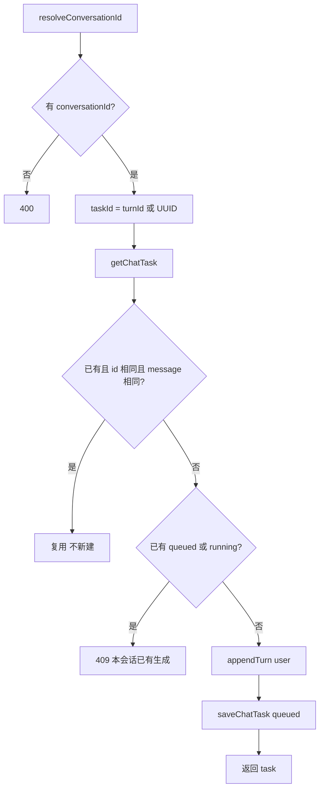

`resolveConversationId`（任务槽走这条，**不允许** query 兜底）：`context.conversation_id` → header `makers-conversation-id` → header `conversationId`。`/resume` 才 `allowQuery`。

必须先 `appendTurn(user)` 再 `saveChatTask`：空会话没有 conversation 行，`updateConversation` 会抛 `MemoryNotFoundError`。`appendMessage` 会把 conversation 建出来。Pipeline 收到 `userMessagePersisted: true`，`getHistory` 会把刚写入的这条当前用户消息从 prompt history 里 `pop` 掉，避免模型看到「历史里已经有一句和当前 turn 一样的 user」。`createTurnLifecycle.finalize` 也不会再 append 一次 user。

幂等：同一 `turnId` + 同一 `message` 再 POST，直接复用 store 里的 task，然后挂到已有 Live Task 上。这覆盖「前端重试同一轮」而不是「用户又说了一遍」。别的 queued/running task 一律 409：`Another generation is already running for this conversation.`

### 5.3 执行：启动 pipeline，HTTP 断线不停

`ensureChatTaskStarted`：Map 里没有就建；没有 `runPromise` 且仍 active 才启动 `executeLiveTask`。多个 SSE 听众共享这一份 promise。

`executeLiveTask`：

1. 把 task 标成 `running`，清掉旧的 `error` / `finalEvent`，`saveChatTask`。
2. `send = (event) => publish(...)`；若是 `result` / `error`，记下 `finalEvent`。
3. `withTaskAbortSignal`：浅拷贝 `context`，只替换 `context.request.signal` 为 **任务** `AbortController.signal`。沙箱 / store / tools 仍是原来的。
4. `intent === 'deploy'` → `runDeployPipeline`，否则 `runChatPipeline`。两条都带 `userMessagePersisted: true`。
5. pipeline 抛错且还没有终帧 → 补发 `{ type: 'error' }`。
6. 终态推导和回收见第 5.5 节。

`createSSEResponse` 仍把 **HTTP** `request.signal` 传给生成器。这条信号只关掉流：`signal.aborted` 时 generator `return`，`finally` 里 `listeners.delete`。它**不会**传到 `query()`。

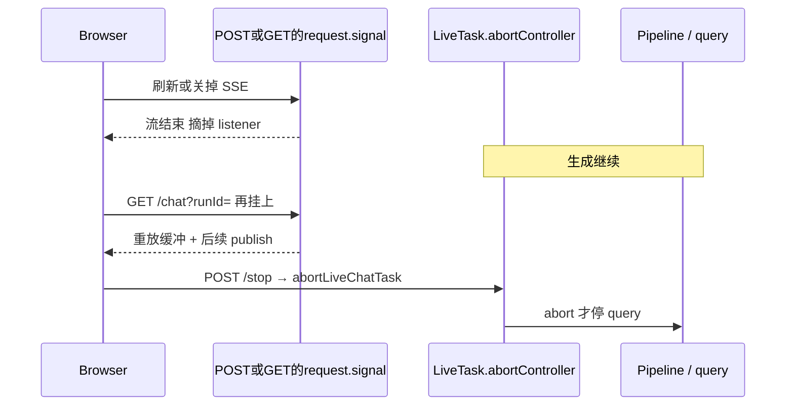

停止路径见第 5.5 节。

### 5.4 投递：`publish` 与挂流

```text
publish(event)
  → 若是 file_content 且同 path 已有旧帧：splice 掉旧的
  → sequence = ++nextSequence
  → push 到 events
  → 超过 2000 条：丢掉最老的，只留最后 2000
  → 通知每一个 listener
```

`file_content` 带整份文件。重连客户端只需要该 path 的最新正文，同一文件反复写入不能在缓冲里堆 N 份。sequence 仍递增，被覆盖的旧帧从数组里消失，但序号不回收。

终帧是 `result` 或 `error`（`isTerminalEvent`）。挂流 generator 收到后 `return`，由第 6 节的 `createSSEResponse` 写 `[DONE]`。`ping` 不进这里。

`createChatTaskAndStreamResponse`：创建（或复用）→ `createLiveTaskStreamResponse`。  
`createChatTaskStreamResponse`：从 query / url 读 `runId` | `turnId` | `taskId`，对不上 store → 404；对上了走同一条挂流函数。

挂流 generator：

1. 先 yield `task_started`（`runId` / `conversation_id` / 当前 status）。这条不进缓冲，每个连接都会再发一次。
2. 记下当时的 `afterSequence = liveTask.nextSequence`，再 `listeners.add`。listener 只把 **大于** `afterSequence` 的新帧推进该连接的 `AsyncEventQueue`。
3. 重放缓冲里 `sequence <= afterSequence` 的帧（创建订阅之前已经发生的事）。
4. 若此时任务已不 active：再扫一遍 `sequence > afterSequence` 的帧（重放期间任务刚好结束的竞态），然后结束。不写半截流。
5. 否则 `Promise.race(queue.next(), HTTP abort)`。收到终帧就 return。
6. `finally` 摘掉 listener。没有听众不等于任务结束。

`AsyncEventQueue` 是进程内手写队列：有人在 `next()` 上等就直接唤醒，否则推进数组。每个 SSE 连接一份，互不影响。

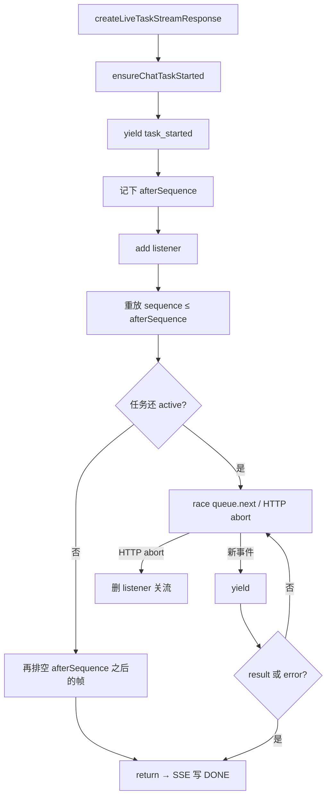

### 5.5 终态、停止、回收

`executeLiveTask` 收尾：

1. 由终帧推导 status：`result.data.stopped` → `stopped`；`result.data.ok === false` → `failed`；否则 `completed`。没有终帧但有 error → `failed`。
2. `saveChatTask` 写入终态（含 `finalEvent`）。失败只打日志，不回滚已经跑完的 pipeline。
3. 5 分钟后：若没有 listener、任务已不 active、Map 里仍是这个对象 → `liveTasks.delete`。

`/stop` 是唯一应该停生成的路径。`abortLiveChatTask` 扫 Map 里该 `conversationId` 的所有 Live Task（不只当前 runId），对未 abort 的调用 `abort()`，并立刻把内存里的 status 改成 `stopped`。这样刷新发生在 pipeline 还在 unwind 时，resume 不会把这轮当成 `activeTask` 再去重连。随后 `markChatTaskStopped` 再写 store；已是终态则不动。

`stop.ts` 在 abort 之后还会：`context.utils.abortActiveRun`（取消平台侧长命令，避免 snapshot 排在 install/build 后面）→ 除非 `discardProject` 否则立刻打项目快照 → 可选把前端传来的 turn 写入 `activityHistory`（running 的 tool 改成 `stopped`）。`discardProject=true` 是「停掉并开新项目」，不打没人会用的 zip。

冷启动后 Map 是空的。`GET /chat?runId=` 按 store 重建 Live Task：已有 `finalEvent` 则缓冲只放这一帧；store 仍是 `queued` / `running` 则 `ensureChatTaskStarted` 再跑（同进程已有 `runPromise` 不重入）。进程被回收后，客户端靠 `finalEvent` 或 resume 的 `activeTask`，不靠 Map。

### 5.6 和前后层的交接

`assistantMessageId` 就是 `turnId` / `runId`。客户端 `AbortController` 只取消这次 fetch；`GET /status` 只读 store，不碰 Live Map。挂流见第 6.4–6.6 节。

| 方向 | 约定 |
|---|---|
| 路由 → 槽 | message 已 trim；deploy 空消息已填默认句；`turnId` 可选 |
| 槽 → pipeline | `send`、`turnId`、`userMessagePersisted: true`、`resetProject` |
| pipeline → 槽 | 所有 UI 事件走 `send`；必须以 `result` 或 `error` 收尾 |
| 槽 → store | queued / running / 终态各写一次 `chatTask`；用户消息在创建时已 append |
| 槽 → 浏览器 | 第 6 节的 Chat SSE；`task_started` 每条连接都有；`[DONE]` 只在正常收尾时出现 |
| resume → 浏览器 | 只暴露 queued/running 为 `activeTask` + `streamUrl`；completed 不重连 |

任务槽不 import SDK，也不知道脚手架或预览端口。它只保证：**执行活在进程里，投递可以来了就走。** 帧格式和两条流的差别见第 6 节。

---

## 6. SSE 传输

任务槽解决「执行活过 HTTP」；SSE 解决「浏览器怎么边跑边看见」。生成可以到 1800s，不能等 `result` 再一次 JSON 回来。平台路由是 HTTP Agent，没有单独的 WebSocket 通道，所以用 `text/event-stream`。

不是 W3C 带 `event:` 名的 SSE。每一帧都是 `data: <JSON>\n\n`，结束帧是字面量 `data: [DONE]\n\n`。类型在 JSON 的 `type` 字段里。

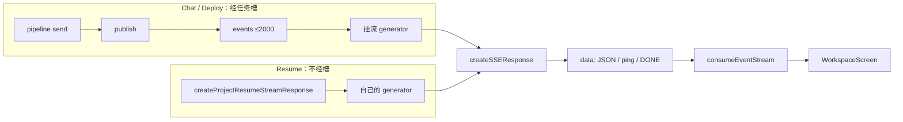

两条流共用包装器和解析器，**不共用缓冲**。Chat 断线可以 `GET /chat?runId=` 重放；Resume 断线只能再打一次 `GET /resume`（或 `POST /resume?stage=`）。

### 6.1 帧格式与 `createSSEResponse`

文件：`agents/_shared.ts`。Chat 挂流和 Resume 都走这里。

```ts
sseEvent(data) → `data: ${JSON.stringify(data)}\n\n`

createSSEResponse(generator, httpSignal)
  → ReadableStream
  → 每 5s enqueue ping（不经过 generator、不进任务缓冲）
  → for await generator：逐帧 enqueue
  → 正常结束（HTTP 未 abort）才写 `data: [DONE]\n\n`
  → generator throw（且不是 AbortError）：先写 `{ type: 'error' }` 再 DONE
  → HTTP abort：不写 DONE，客户端已经走了
```

响应头：`content-type: text/event-stream; charset=utf-8`，`cache-control: no-cache, no-transform`，`connection: keep-alive`，`x-accel-buffering: no`（避免前置代理攒齐再吐）。

`httpSignal` 是**这条连接**的 `request.signal`，只关流。Chat 的模型循环认的是任务槽那把 `AbortController`，见第 5.3 节。

`task_started` 由挂流 generator 直接 `yield`，不进 `publish`，所以每条连接都会再收到一次。`ping` 也是每条连接自己的。重连不会重放这两种。

### 6.2 Chat 事件：谁推、谁收

类型在 `shared/protocol.ts` 的 `ChatStreamEvent`。Pipeline 只 `send(...)`；任务槽 `publish`；前端 `handleStreamEvent`。

| `type` | 谁 `send` | 缓冲？ | 前端做什么 |
|---|---|---|---|
| `task_started` | 挂流 generator，不经 `send` | 否 | 记住 `conversation_id` / `runId` |
| `status` | 槽启动、workspace restore 等 | 是 | 忽略（不画气泡） |
| `text_segment` | Chat：`runCodingAgent` → `forwardProgress` | 是 | `appendNarrationChunk` |
| `tool_use` / `tool_result` | Chat 转发模型工具；Deploy 伪装成 `commands` | 是 | `upsertToolActivity`；`sawProjectActivity=true` |
| `log` | 首轮脚手架 | 是 | 只把 `sawProjectActivity` 置位，不单独画 |
| `file_content` | Chat：写文件后，单文件 ≤96KiB 且本轮 ≤2MiB | 是，同 path 只留最新 | `fileCache.write`，先不展开面板 |
| `file_tree` | 脚手架成功或写文件后 | 是 | 挂 Files；有待开 path 则打开第一份 |
| `preview_ready` | `makers dev` 解析到 URL 时立刻 | 是 | 换 iframe，不等 `result` |
| `deployment_status` | Deploy 或模型 deploy 的每一步 | 是 | 独立部署卡片 |
| `agent` | Chat 在模型结束后、验证前 | 是 | 纯问答：气泡 `done`；写过项目：只 patch 正文，仍 `running` |
| `result` | 每条占槽线的**必须**终帧 | 是，并写入 `finalEvent` | `applyResponse`：build / files / preview / 终回复 |
| `error` | 槽 catch，或 `createSSEResponse` catch | 是（槽发的） | 气泡 `error` |
| `ping` | `createSSEResponse` 心跳 | 否 | 忽略 |

`agent` 不是终帧。验证和 auto-fix 还在后面，`result` 才带 `build` / `preview`。`isTerminalEvent` 只认 `result` 和 `error`：只有它们让挂流 `return`，并让槽把 `chatTask` 写成终态。

Deploy 也走这张表：没有 `text_segment` / `file_content`，但有伪装的 `tool_use` 和 `deployment_status`，最后仍是 `result`（不带 `build`，避免冲掉上一轮生成的检查结果）。

### 6.3 Resume 事件

类型：`ResumeStreamEvent`。`createProjectResumeStreamResponse` 自己 `yield sseEvent(...)`，**不**进 `liveTasks`。

| `type` | 何时 | 前端 |
|---|---|---|
| `resume_history` | 立刻，只读 store | 画出消息 + activity；若有 `activeTask` 立刻 `GET /chat?runId=`（第 6.5 节） |
| `resume_workspace` | `needsWorkspace` 时，restore 之后 | 文件树、preview、deployment |
| `resume_file_content` | 最多 48 个 / 合计 2MiB | `fileCache.write`，避免再打 `/file` |
| `error` / `ping` | 包装器或失败 | ping 忽略 |

`POST /resume` 仍是 JSON（`stage=history|workspace|preview`），给旧客户端和「只续 iframe token」。新 UI 冷启动只打一条 `GET /resume` SSE。

workspace 阶段失败时仍可能 yield 一条 `resume_workspace`（`ok: true` 带 error 字段），让 UI 先有文件树，而不是整条流变 `error`。实现见第 7.5 节。

### 6.4 客户端怎么拆帧

文件：`app/features/workspace/sse.ts` 的 `consumeEventStream<T>`。Chat 和 Resume 共用，`T` 分别是 `ChatStreamEvent` / `ResumeStreamEvent`。不碰 React。

1. `ReadableStream` 按块 decode，用 `\n\n` 切帧；半截 JSON 留在 buffer。
2. 帧内只收以 `data:` 开头的行，去掉前缀后拼起来。
3. payload 是 `[DONE]` → 停，后面的帧丢掉（`tests/sse-parser.test.ts` 钉死 DONE 之后的 `error` 被忽略）。
4. 流结束但没有 DONE、buffer 里还有字 → `flush` 再解析一次（最后一帧没带空行）。
5. `finally` 里 `reader.cancel()`。服务端可能先写 DONE 却不关 HTTP；不 cancel 的话 keep-alive 会挡住 `makers-dev` 的 SIGINT。

不是 `EventSource`：要自己带 `conversationId` / `makers-conversation-id`，还要复用 POST 的 Response body。

### 6.5 前端怎么挂上两条流

`workspace-api.ts`：`startChatTask` = `POST /chat`；`fetchChatTaskStream` = `GET /chat?runId=`；`openResumeStream` = `GET /resume`。

`WorkspaceScreen.attachChatStream`：

- 新消息：`sendMessage` 先画好 user / assistant 气泡，`assistantMessageId` 当 `turnId` POST，**同一 Response** 立刻交给 `consumeEventStream`。
- 刷新：先 `GET /resume`。`resume_history` 若带 `activeTask`（queued/running），再 `GET streamUrl`，**不再 POST**。`/stop` 可能已把 activity 写成 stopped，store 仍短暂是 running——`turnAlreadyFinished` 避免再插一套 `${turnId}-user`。
- 客户端 `AbortController` 只取消这次 reader。真正停止走 `POST /stop`。
- `workspaceEpoch`：开新项目会加一。旧流后到的事件若 epoch 对不上，整段丢掉，避免旧 `finally` 清掉新回合的 loading。

Resume 流上的 `ping` 直接忽略。history 先到就可以画对话，workspace 还在同一条 HTTP 上继续。

### 6.6 事件到 UI 的分叉

`handleStreamEvent` 是这次 `attachChatStream` 闭包里的函数。`sawProjectActivity` 是闭包 `let`，不是 React state。

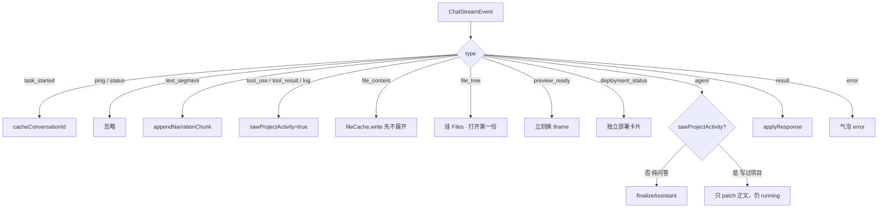

没调过工具时，`agent` 一到气泡就 `done`（「你是谁」）；写过项目则等到 `result`，因为后面还有验证。`file_content` 只做缓存，等随后的 `file_tree` 再展开右侧，避免 Files 列表还是空的。

---

## 7. `pipelines/` 模块

第 4–6 节把事件长什么样、谁占槽、怎么推到浏览器说完了。这一节回答：这一轮谁编排、何时进模型。只有 Chat 会进第 8 节的生成内部；Deploy / Resume 到此为止。

`agents/pipelines/` 是运行时的**回合编排层**。Pipeline 不拥有 HTTP，也不拥有任务槽。占槽的线拿到已经换过 abort 信号的 `context`、用户原文和一个 `send`，按固定顺序做事，用 `result` / `error` 收尾；不占槽的线自己返回 `Response`。任务槽只保证「执行活着、听众可换」；**这一轮做什么、何时写盘、回不回模型**，全在这里。

文件名必须以下划线开头（`tests/architecture.test.ts`），否则会被 Makers 扫成公开路由。对外再导出走 `agents/_pipelines.ts`。`_status.ts` 被 `status.ts` 直接 import，没有进这个 barrel。

### 7.1 已有 pipeline 一览

#### 对外业务线（7 条）

七条线是七种业务，不是七种模型。只有 Chat 会思考；Deploy 是固定脚本；其余都是读。

**占槽** = 同一会话同一时刻只允许一条线改沙箱。Chat 写代码、Deploy 发布，必须互斥；刷新、读文件、导出若也占槽，会把还在跑的生成挤成 409，所以后五条绝不占槽。

| 流水线 | 干什么 | 入口 | 占槽 | SDK | 展开 |
|---|---|---|---|---|---|
| Chat `_chat.ts` | 用户说一句话，改项目 | `POST /chat` | 是 | 是 | 第 7.3 节 |
| Deploy `_deploy.ts` | 一键发布，不经过模型 | 同上，`intent: 'deploy'` | 是 | 否 | 第 7.4 节 |
| Resume `_resume.ts` | 刷新后把会话画回来 | `GET /resume` SSE；`POST` 按 stage | 否 | 否 | 第 7.5 节 |
| File `_file-read.ts` | 点文件树读源码 | `GET /file` | 否 | 否 | 第 7.6 节 |
| Download `_download.ts` | 当前项目打 zip | `GET /download` | 否 | 否 | 第 7.6 节 |
| Status `_status.ts` | 这轮任务跑完没有 | `GET /status` | 否 | 否 | 第 7.6 节 |
| Transcript `_transcript.ts` | 导出整段对话 | `GET /transcript` | 否 | 否 | 第 7.6 节 |

#### 目录内支撑文件（不对外当路由）

| 文件 | 被谁用 | 做什么 |
|---|---|---|
| `_workspace.ts` | Chat、Deploy | `prepareProjectWorkspace`：reset 或 restore 沙箱，返回 `ProjectState` |
| `_turn-lifecycle.ts` | Chat、Deploy | `createTurnLifecycle`：记 activity，`finalize` 按快照 → state → 对话提交 |
| `_helpers.ts` | 多条线、`stop.ts` | checkpoint、续沙箱超时、`ensureProjectDependencies`、压回复、文件推送预算（96KiB / 2MiB） |
| `_resume-files.ts` | Resume | 按 `selectResumeCacheFiles` 分批读最多 48 个源文件 |

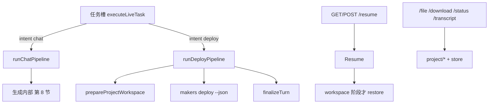

### 7.2 三条线共用的底座

- **`send`**：Pipeline 不碰 `liveTasks`。所有 UI 事件都 `send(...)`，由任务槽 `publish` 再变成 SSE（第 6 节）。必须以 `result` 或 `error` 收尾，否则槽位无法从 `running` 掉下来。`abortSignal` 来自任务槽换过的 `context.request.signal`，不是原始 HTTP。
- **超时**：每条线开头 `extendExistingSandboxTimeout(1800)`，避免长回合被平台先收回沙箱。
- **工作区 / 回合提交 / checkpoint**：Chat 和 Deploy 都调 `prepareProjectWorkspace` 与 `createTurnLifecycle`。这三块的实现见第 8 节，Resume 的 restore 用同一套 `restorePersistedProject`。

### 7.3 Chat Pipeline（核心）

`runChatPipeline(context, message, send, { resetProject?, turnId?, userMessagePersisted? })`（`_chat.ts`，约 620 行）。唯一会进 SDK 的线。空 message / 空 conversationId 立刻 `send({ type: 'result', data: { ok: false, build: { status: 'skipped' } } })`，不准备工作区。

它把第 8 节那四步串起来，并决定何时验证、如何压回复。`query()` 见第 8.2 节；事件泵见第 8.3 节；三层 prompt 见第 9.1 节。四步本身（准备、模型循环、校验、提交）不在这里展开。

实现骨架：

1. `extendExistingSandboxTimeout` → `prepareProjectWorkspace` → `getHistory` → checkpoint + `createTurnLifecycle`
2. 挂回调后 `await runCodingAgent(...)`（`isNewProject = !state.created`）
3. 按下面决策树 `finalize` + `send(result)`，必要时再进一次 `runCodingAgent`（auto-fix）

#### 开场

`extendTimeout` → `prepareProjectWorkspace` → `getHistory(limit=50)`。`resetProject` 时 history 清空。`userMessagePersisted` 时 `getHistory` 会 `pop` 掉刚写入的那条当前 user，避免 prompt 里出现两遍。

然后建 checkpoint、`createTurnLifecycle`，再挂四组回调给 `runCodingAgent`：

| 回调 | 做什么 |
|---|---|
| `handleScaffoldLog` | 仅 `!state.created` 的首轮把脚手架 log 推到 SSE |
| `forwardProgress` | 记 activity 并 `send`。非首轮的 `ensure_project_scaffold` 整段（use + result）丢掉，避免改需求时再闪一次脚手架。`text_segment` 会剥预览 URL |
| `handleProjectFilesChanged` | 单文件 ≤96KiB 且本轮合计 ≤2MiB 才推 `file_content`（path 相对 `appDir`），随即 `file_tree`，再 `checkpoint.schedule`。超预算的文件让用户点 `/file` |
| `handlePreviewReady` | 一有 URL 就写 `state`、eager `saveProjectState`、立刻 `preview_ready`。不等验证结束，iframe 先亮 |
| `handleDeploymentStatus` | 同样 eager 写入 `state.deployment` 并推 `deployment_status`，刷新不会丢「发布中 / 已发布」 |

`isInitialProjectTurn = !state.created`。`activityTurnId` 优先用前端 `turnId`。

#### 模型返回后的分支（按源码顺序，先命中先 return）

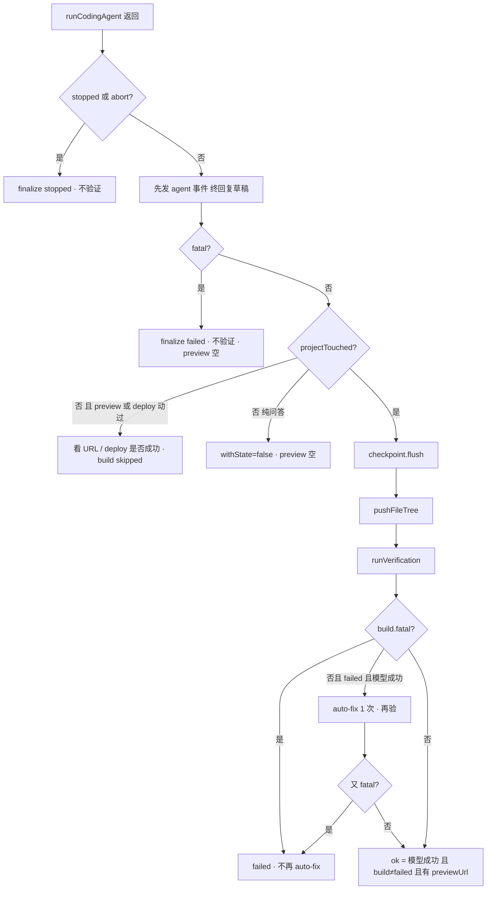

含义：

1. **停**：中英回复按用户消息是否含 CJK 选。`withSnapshot` 仅当本轮写过文件。
2. **fatal**：沙箱级故障（见第 8.3 节）。不跑 build，preview 留空。
3. **没写文件，但碰了 preview / deploy**：例如用户只说「重新预览 / 发布」。`ok` 要求模型成功，且该碰的通道真的就绪。不跑 `runVerification`，避免一次发布把上次的 build 卡片清掉。
4. **纯问答**：`finalize(..., { withState: false })`，不把问答写进 `projectState`。
5. **写过文件**：先 flush，再验证。验证窗口可能很长，flush 保证沙箱被回收时 Blob 里已有源码。

#### 终回复怎么压

在发 `agent` 事件时就算一版，验证结束后可能再算一版（auto-fix 或失败文案）：

1. 模型成功且有 output → `sanitizeAssistantText`
2. 泛化完成句（「已编写完成，请查看结果」等）丢掉
3. 空则用 `buildRequirementConclusionFallback`（按 pending / ready / generated）
4. `stripReturnedPreviewLinks`：气泡里不许出现预览 URL
5. 写过项目才 `compactUserFacingReply`（压成一两句；超 180 字回退 fallback）
6. **仅当本轮** `deploymentTouched && status==='success'` 才 `withLiveDeploymentUrl`。`state.deployment` 会跨轮活着，不能每轮都把昨天的线上地址再贴一遍

验证后的成功条件：`modelResult.success && build.status !== 'failed' && Boolean(state.previewUrl)`。build 失败或没有 preview，改用固定失败句，不再用模型长文。

`result.build` 带上 `autoFixAttempts` / `autoFixApplied`。下载链只是指针 `{ url: '/download', filename: 'source.zip' }`，zip 由 `/download` 现场打。验证与 auto-fix 的实现见第 8.4、8.5 节。

### 7.4 Deploy Pipeline（核心）

`runDeployPipeline(context, message, send, { turnId?, userMessagePersisted? })`（`_deploy.ts`）。发布不是创作：项目、凭证、目标项目名在按钮能点之前就定了，再进模型只会多一次「它去做点别的」的机会。它仍然走任务槽，所以发布和生成不会同时改沙箱。

默认文案：`DEFAULT_DEPLOY_REQUEST = 'Deploy this project'`（路由在 message 空时填）。中英 copy 按请求是否含 CJK 选。

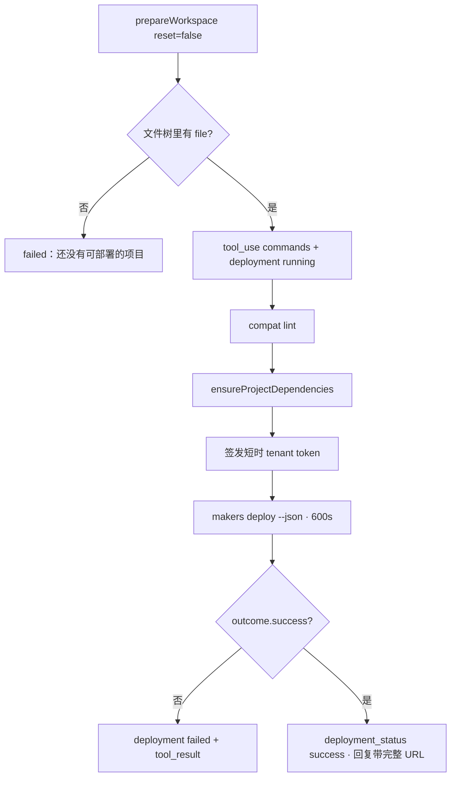

要点：

- **不写 `result.build`**。发布不跑验证；若带上 build 会把上一轮生成的检查结果清掉。
- 时间线伪装成模型也会打的那条：`tool_use` name=`commands`，`inputSummary='edgeone makers deploy'`。`tests/deploy-task.test.ts` 要求无论按钮还是模型触发，transcript 都是一行 “Deploy project”。
- `deployment_status` eager `saveProjectState`，刷新仍能看到发布条。
- 进 CLI 之后注释写明：abort 只能停「我们读结果」，停不了已经发出去的 publish，所以这次运行会看到底。
- 失败回复只取错误首行，超 200 字截断；token 经 `redactSecret` 再回给 UI。
- 成功回复：`withLiveDeploymentUrl('已发布到线上。', url)`，线上地址出现在气泡里（预览 URL 仍然禁止）。
- checkpoint 建了但不会 dirty：发布不改源码。

超时：`DEPLOY_TIMEOUT_SECONDS = 600`。依赖：没有 `package.json` → `ensureProjectDependencies` 返回 false；有包但没 `node_modules` 才 `npm install`（300s）。

### 7.5 Resume Pipeline（核心）

`_resume.ts`。**不进任务槽**，也没有占槽那种 `send`。它分阶段，好让刷新先画出对话，再慢慢恢复沙箱。SSE 帧见第 6.3 节。内部还有 `_resume-files.ts` 负责源文件预热。

| 入口 | 函数 | 形态 |
|---|---|---|
| `GET /resume` | `createProjectResumeStreamResponse` | 一条 SSE：先 `resume_history`，若 `needsWorkspace` 再 `resume_workspace`，然后最多 48 个 `resume_file_content` |
| `POST /resume` | `runProjectResumePipeline` | JSON。`stage=workspace` / `preview` / 默认 `history`，兼容旧客户端和「只续 iframe token」 |

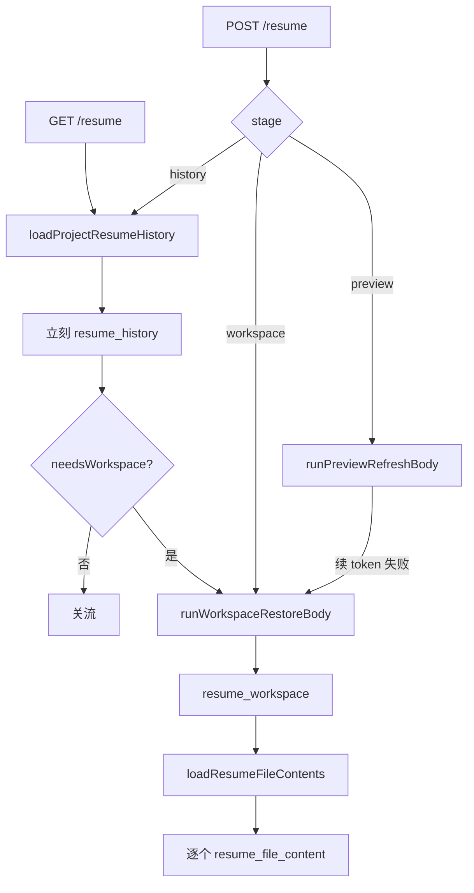

#### history（只读 store，不碰沙箱）

并行读：messages、`activityHistory`、legacy snapshot、`chatTask`、`projectState`。

- `hasProject`：有 snapshot，或 `state.created`，或 activity 里出现过写文件 / makers CLI。stop 写到一半可能还没 flush，沙箱里却有文件，所以不能只看 snapshot。
- `hasPreview`：`previewUrl` / `previewPublished`，或 activity 里有成功的 `makers dev`。
- `activeTask`：仅当 `chatTask` 是 `queued` / `running`。带 `streamUrl: /chat?runId=<id>`。前端据此 GET 重连，不重新 POST。已完成的任务不出现在这里。
- `needsWorkspace = hasProject`。没有项目就只回历史，SSE 到此结束。

#### workspace（预算 600s）

`SANDBOX_PROBE_MS=15s` → 没有文件则 `RESTORE_BUDGET_MS=45s` 拉 snapshot（`installDependencies: false`）。仍没有文件：`hasProject: false`，空文件树，preview 上挂 error。

有文件后：

- `generationActive`（槽里还在 queued/running）时 **不** 重启 preview，避免和正在跑的 `makers dev` 抢端口。
- 只在「以前成功预览过」时重启。禁止用「有没有 `package.json`」当条件：生成中途停下时常已有脚手架，但还不能预览。
- 重启预算 `PREVIEW_RESTART_BUDGET_MS=540s`（依赖 + 冷启动 makers dev）。失败：清掉当前 preview URL，但 **保留** `previewPublished`，下次刷新还会再试，而不是永远停在 Files。
- 从未预览过：清掉 preview 字段，保持 files-only。
- 线上 Makers URL（`previewKind==='makers'` 或 URL 像 deploy）不当成沙箱预览去改 `access_token`。

`republishPreviewOnResume`：先 `assertPreviewServerReady`，能改写旧 URL 上的 token 就改写（iframe 不闪）；否则用当前 `getHost()` 的公开链接；再不行才 `ensureProjectDependencies` + `startPreviewServer`。

#### preview（轻量续期）

页签没关、只是 iframe token 过期时走这条。没有过预览 → 空 preview。续失败则 **升级** 成完整 workspace restore，总预算仍是 600s。

#### 文件预热

`loadResumeFileContents`：`selectResumeCacheFiles` 最多 48 个、合计 2MiB、单文件 256KiB，优先 `package.json` / `index.html`。每批 12 个并行读。失败的文件不发事件，用户点开时再走 `/file`。

workspace / preview 超时或失败时 HTTP 仍常回 `ok: true` + `preview.error`，避免前端把整次 resume 当致命错误清掉会话。

### 7.6 辅助流水线

都不占槽，不进 `query()`。下载和读文件可能 restore。

| 文件 | 实现要点 |
|---|---|
| `_file-read.ts` | `path` 单文件或逗号分隔 `paths` 批量（最多 `PREVIEW_BATCH_MAX_FILES=12`）。path 必须能 `toAppRelPath` 到 `appDir`，否则 400。批量走 `readFilesFromSandbox`，单文件走 `readFileFromSandbox`（可带截断标记）。缺 `conversationId` 打诊断日志后 400 |
| `_download.ts` | `createProjectArchive`；沙箱空则 `restorePersistedProject({ installDependencies: false })` 再打一次。仍失败 409。成功返回 `{ filename, contentType, size, base64 }`，上限见 `DOWNLOAD_ARCHIVE_MAX_BYTES`（60MiB） |
| `_status.ts` | 只读 `getChatTask`。query 里的 `conversationId` 优先于粘滞头（`resolveConversationIdPreferQuery`），方便 curl 轮询不被钉到忙实例 |
| `_transcript.ts` | 并行读 activity、history、`chatTask`，`buildTranscriptJsonl` + `conversationExportFilename`，`content-type: application/x-ndjson` |

`stop.ts` 不是一条 pipeline，但会调 `_helpers.persistProjectSnapshot`（`discardProject` 时不打）。

---

## 8. 生成内部

架构图里的「生成内部」只属于 Chat Pipeline。四个块的**真实顺序**是准备 → 模型 → 验证 → 提交，不是并列，也不是 `finalizeTurn` 先于 `runCodingAgent`。

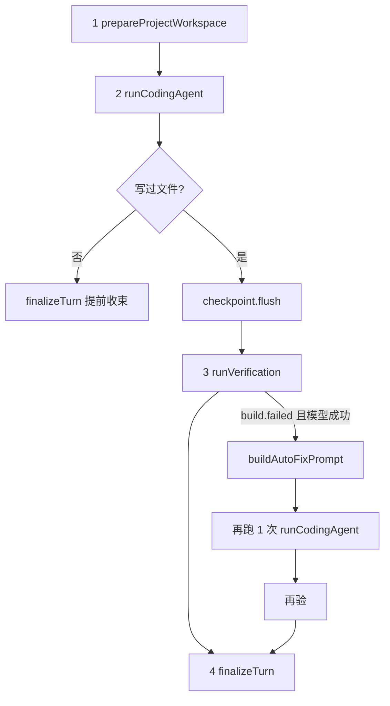

`finalizeTurn` 是每个出口的提交。auto-fix 虚线只从验证连回模型，且最多一次。模型这一步由 `runCodingAgent` 驱动一轮 `query()`，不是 Chat Completions。工具面怎么拼、prompt 写什么，见第 9 节。

### 8.1 `prepareProjectWorkspace`

文件：`pipelines/_workspace.ts`。在模型动手前，让沙箱 `projects/<id>/app` 可写，并返回本轮 `ProjectState`。Chat 和 Deploy 开头都调它。Resume 的 workspace 阶段自己探沙箱，但 restore 用同一套 `restorePersistedProject`。

路径：`sessionDir = projects/<safeSegment(conversationId)>`，`appDir = sessionDir/app`。`resetProjectWorkspace` 先 `assertResettableProjectPath`：`sessionDir` 必须匹配 `projects/[a-zA-Z0-9_-]+`，`appDir` 必须正好是 `sessionDir/app`，否则 throw，防止 `rm -rf` 打偏。

| `resetProject` | 做什么 |
|---|---|
| `true`（首页新开） | `createProjectState`（`created: false`，清掉 preview / deployment）→ 若 `appDir` 在则删掉再建 → `clearLegacyProjectSnapshot` → `persist` 空目录。persist 失败只 `send(log)`，不中断本轮 |
| `false` | 读 store 的 `projectState`，`separateLegacyMakersDeployment` 把误存在 `previewUrl` 里的线上地址拆到 `deployment`。`appDir` 没有文件则 `restorePersistedProject` |

restore 顺序：先 `sandbox.restore({ path: appDir })`（Blob）；没有再读 legacy base64 zip，解开后 persist 并删掉 legacy。Chat 这条线 restore 时默认会 `npm install`（没有 `package.json` 或已有 `node_modules` 则跳过）。Resume 传 `installDependencies: false`，安装推迟到重启 preview。

最后 `makeDir(sessionDir)` + `makeDir(appDir)`。沙箱里已有文件则 `state.created = true`。这一步**不**调模型。

### 8.2 `query()`：模型主循环

第 7 节已经说明：只有 Chat Pipeline 会走进模型。走进去之后，宿主调用的是 Claude Agent SDK 的 `query()`，而不是自己拼一次 Chat Completions。`runCodingAgent`（第 8.3 节）负责把 SDK 事件翻成 pipeline 回调。

**SDK 只用在 `agents/` 里跑模型的那一段。** `app/`、`shared/`、Deploy / Resume 都不 import `@anthropic-ai/claude-agent-sdk`。

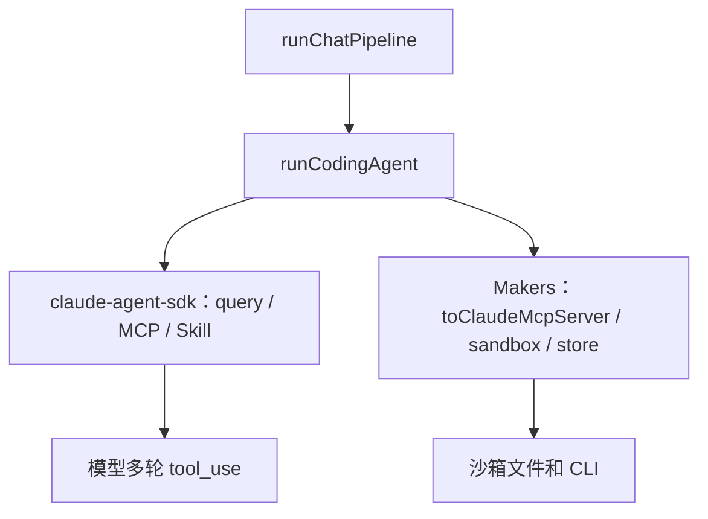

SDK 只负责：模型怎么想、怎么调工具、怎么把流式事件吐出来。工具执行、沙箱、任务槽、SSE、验证都在 SDK 外面。

#### 直接 import 的文件

| 文件 | SDK API | 作用 |
|---|---|---|
| `agents/_agent.ts` | `query`、`createSdkMcpServer`、`SDKMessage`、`SDKResultMessage` | 整段模型循环 |
| `agents/tools/_project-tools.ts` | `tool`（代码里叫 `defineClaudeTool`） | 定义 `ensure_project_scaffold`、`write_project_file` |
| `agents/tools/_makers-skills.ts` | `tool` | 定义 `load_makers_skill` |
| `agents/_types.ts` | `SdkMcpToolDefinition` | 包装后的 MCP 工具类型 |

`pipelines/_chat.ts` 只调用 `runCodingAgent`，自己不 import SDK。`runDeployPipeline` 完全不走 SDK。

#### `query()` 是什么

不是「发一条 Chat Completions」。它启动 **Agent 主循环**：带着 `systemPrompt` + `prompt` 调模型，模型要工具就在进程里执行，把结果喂回去，直到 `type: 'result'` 或 abort。

```ts
const sdkQuery = query({
  prompt: userMessage,              // 这次要干什么（auto-fix 时换成修复说明）
  options: { systemPrompt, ... },  // 人设、工具、MCP、abort
});

for await (const event of sdkQuery) {
  // stream_event / assistant / user(tool_result) / result
}
```

返回值是 `AsyncIterable<SDKMessage>`。本仓库只在 `runCodingAgent` 里调用；Chat 的 auto-fix 会再进一轮。Deploy / Resume 不调用。事件泵见第 8.3 节。`sdkOptions`：

| 选项 / API | 取值 | 本项目用它做什么 |
|---|---|---|
| `query({ prompt, options })` | 用户原文 + 上面整表 | Agent 主循环，直到 `result` 或 abort |
| `createSdkMcpServer` | `name: edgeone-sandbox` | 沙箱工具 + 三个自定义工具绑成进程内 MCP |
| `tool()` | Zod schema + handler | 自定义工具入参校验与执行 |
| `permissionMode` | `dontAsk` | 无人值守，不弹确认 |
| `maxTurns` | `100` | 单轮工具回合上限 |
| `tools` | `['Skill']` | 关掉 SDK 自带 Read / Write / Bash |
| `skills` | `['edgeone-makers-tools']` | 允许从 `.claude/skills/` 按需加载（正文主要靠 `load_makers_skill`） |
| `includePartialMessages` | `true` | 流式旁白和 tool input JSON，UI 才能边写边显示 |
| `allowedTools` + `strictMcpConfig` | MCP 白名单 | 名单外调不了 |
| `systemPrompt` | `buildPrompt(...)` | 不用 SDK 默认人设 |
| `abortController` | 任务 AbortController | `/stop` 能打断 `query()` |
| `env` | `ANTHROPIC_*` | 网关 key / baseURL / 会话头；默认模型 `@makers/deepseek-v4-flash` |
| `for await` `SDKMessage` | `stream_event` / `assistant` / `user` / `result` | 旁白、工具进度、终态 |

可选：`pathToClaudeCodeExecutable`（`CLAUDE_CODE_EXECUTABLE_PATH`）、`debug`、`stderr`。

#### 不是 SDK、容易混在一起的东西

| 能力 | 真正归属 |
|---|---|
| `context.tools.toClaudeMcpServer` | Makers 运行时：把沙箱工具转成 SDK 能挂的 MCP 定义 |
| `context.sandbox` / `persist` / `restore` | Makers 沙箱与 Blob |
| `context.store` | Makers 会话存储 |
| SSE、任务槽、校验、预览端口、token 注入 | 本仓库宿主代码 |

缺 key 或缺 baseURL 的处理见第 8.3 节，不在这里重复。

### 8.3 `runCodingAgent`

文件：`agents/_agent.ts`。Chat Pipeline 进模型的唯一入口。自己不 `finalize`、不验证；只跑一轮 `query()`，用回调把旁白、工具、文件、预览推给 pipeline。

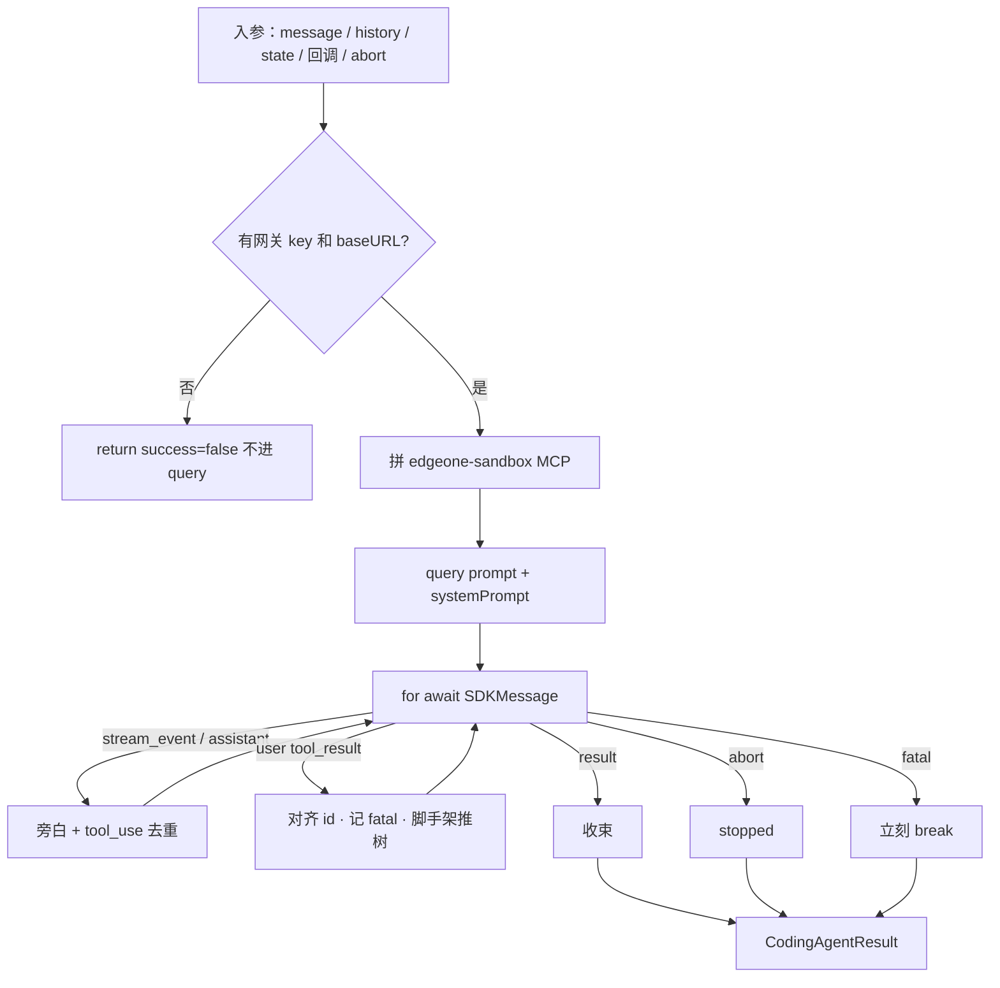

#### 进 `query()` 之前

1. 读 `AI_GATEWAY_*`，兜底 `ANTHROPIC_*` / `DEEPSEEK_*`。缺 key（含 `ANTHROPIC_AUTH_TOKEN`）或 baseURL 直接返回，不启动 SDK。
2. `abortSignal` 已 aborted → `{ stopped: true }`，不拼 MCP。
3. 没有 `context.tools.toClaudeMcpServer` → throw，进 catch，不进 `query()`。
4. `toClaudeMcpServer('edgeone-sandbox')` → 去掉 browser / 通用 `files_write` → `wrapSandboxTools` → 挂上三个自定义工具 → `createSdkMcpServer`（见第 9.2 节）。
5. `buildPrompt(...)` 做成 `systemPrompt`（见第 9.1 节）。
6. 任务槽的 `abortSignal` 挂到 SDK 的 `AbortController`：HTTP 断线不停循环，只有 `/stop` 会 abort。`cwd` 是 Agent 进程的 `process.cwd()`，不是沙箱 `appDir`；文件和命令都走 MCP。

#### `query()` 两个参数

| 参数 | 第一次（用户回合） | auto-fix 再入 |
|---|---|---|
| `prompt` | 用户原句 | `buildAutoFixPrompt` 拼出的修复说明 |
| `options.systemPrompt` | 都是 `buildPrompt`；auto-fix 时 `isNewProject=false`，history 带上本轮问答 | 同左 |

其余 `sdkOptions` 见第 8.2 节。

#### 事件泵（`for await`）

| `event.type` | 宿主做什么 |
|---|---|
| `stream_event` | `extractVisibleNarrationDelta` → `resolveNarrationEmit`（内部 `sanitizeNarrationText`）按 text block 去重 → `onProgress({ type: 'text_segment' })`。`content_block_start` 记下未完成的 tool；`input_json_delta` 拼 JSON；`content_block_stop` 再推一次完整 `tool_use` |
| `assistant` | 完整 text block 当旁白收尾（`complete=true`）；完整 `tool_use` 再推（签名相同则跳过） |
| `user` 且含 `tool_result` | 用事先记下的 name/command 对齐 `tool_use_id`。`is_error` 或 `EXIT:N≠0` 算失败。脚手架成功且本轮未推过树 → 无参 `onProjectFilesChanged()`。仅当 `is_error===true` 才跑 `detectFatalToolError` |
| `system` + `init` | 只 `debugLog` MCP 列表，不推 UI |
| `result` | 记下 `SDKResultMessage`，`break` |
| 循环中 `abort` | 再 abort SDK，`break`，返回 `stopped: true`（**保留**已置上的 touched 旗标） |

`tool_use` 按 `tool_use_id` 记签名，流式半截 JSON 和最终块不会在 UI 闪两次。fatal 命中后立刻退出，必要时 `sdkQuery.return()`，不再等模型下一轮。

循环里维护、最后原样返回的旗标：

| 标志 | 何时置位 | pipeline 怎么用 |
|---|---|---|
| `projectTouched` | 脚手架回调或每次 `write_project_file` | 为 true 才验证；为 false 走问答 / 只预览 |
| `previewTouched` | 包装后的 `makers dev` 解析到 URL | 没写文件时也要判断预览是否成功 |
| `deploymentTouched` | 包装后的 deploy 状态变化 | 终回复只在本轮成功时贴线上 URL |
| `wasCreated` | 脚手架 `{ created }` | 写进 `result.project.created` |
| `fatal` | `is_error===true` 且 `detectFatalToolError` 命中 | 不验证、不 auto-fix |
| `stopped` | 任务槽 abort 或 `AbortError` | `finalize(..., 'stopped')` |

`detectFatalToolError` 只认整段 `^Not Found.?$`、沙箱未初始化、实例满、重复启动。源码正文里的 “not found” 不会误杀。

#### 收束（优先级从上到下）

1. **循环内 abort** → `{ success: false, stopped: true }`，**保留** `projectTouched` / `previewTouched` / `deploymentTouched` / `wasCreated`。用户点停止时，已经写过的文件和亮过的预览不能当没发生。
2. **fatal** 优先于 SDK 自己的 `result`。必要时 `sdkQuery.return()`。
3. 没有 `result` → `The model stream ended without returning a result.`
4. `result.subtype !== 'success'` → 失败，错误取 `errors[0]`。
5. 成功 → `output = sanitizeAssistantText(result.result)`。

`catch` 里的 abort（`AbortError` 或信号已断、但循环还没走到收束）**不**保留旗标：`projectTouched` / `wasCreated` 都是 `false`。throw 时若 `detectFatalToolError` 命中 message，同样标 `fatal`。

返回值类型是 `CodingAgentResult`。模型能调什么、知识从哪来，见第 9 节。

### 8.4 `runVerification`

文件：`project/_scaffold.ts`。确定性检查，**不进模型**。只在 `projectTouched` 且非 stopped / 非 fatal 时由 Chat 调用。

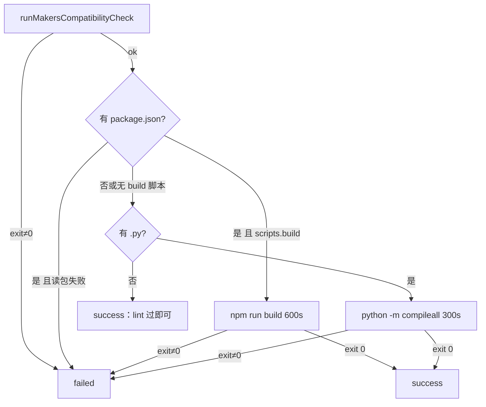

`npm run build` / `compileall` 必须走 `runCommandCapturingExit`（`; echo EXIT:$?`）。沙箱把非零当成 `SANDBOX_UNKNOWN_ERROR` 并丢掉编译器输出；没有这句，auto-fix 看不到真错误。install / 后台 / makers 命令禁止加这句。

抛错时用 `detectFatalToolError` 扫 stdout/stderr/message。命中则 `BuildResult.fatal=true`。fatal 是基础设施挂了，再让模型改代码没有意义。普通 `failed` 才进入 auto-fix。

### 8.5 auto-fix 再入

不是第四条用户请求，也不是新的任务槽。条件：`build.status === 'failed' && !build.fatal && modelResult.success`。`AUTO_FIX_MAX_ATTEMPTS = 1`。

`buildAutoFixPrompt` 拼：原需求 + 上一轮摘要 + 截到 12000 字的日志 + 正则抠出的最多 12 个源文件路径（排除 `node_modules` / `.next`）。要求最小修复、一次写一个文件、修完再 `makers dev`、终回复不要预览 URL。

第二次 `runCodingAgent`：

- prompt = 上面那份，不是用户原句
- history = `[...history, { user: 原句 }, { assistant: 本轮摘要 }]`
- `isNewProject=false`
- 同一套回调、同一个 `abortSignal`

回来后若 stopped → 当停；再 `runVerification`；若第二次 fatal → 失败收束；否则和主路径一样看 `build` + `previewUrl`。

### 8.6 `finalizeTurn` 与 checkpoint

`createTurnLifecycle`（`pipelines/_turn-lifecycle.ts`）在 `runCodingAgent` **之前**就建好，为的是 `recordProgress` 能在模型循环里持续记账：连续 `text_segment` 拼到同一条 text activity；`tool_use` 按 `toolUseId` 建或补；`tool_result` 回填 status / 摘要。它不是生成的第一步。

`finalize(assistant, status, { withSnapshot?, withState? })` 把这一轮写进耐久存储。每个出口都要走，包括问答和停止。

1. `stopped`：把还在 `running` 的 tool 改成 `stopped`
2. `withSnapshot === true` → `checkpoint.flush()`（验证前通常已经 flush 过一次）
3. `withState !== false` → `saveProjectState`（纯问答传 `false`）
4. 槽位已 `appendTurn(user)` 则跳过；否则补写 user
5. `appendTurn(assistant)`（先 `sanitizeAssistantText`）
6. `saveActivityTurn`：最多保留 25 轮，每轮最多 50 条 activity

提交顺序：**快照 → projectState → 对话**。验证窗口很长，写过文件的路径在进 `runVerification` 之前已经 `checkpoint.flush()` 过；finalize 再 flush 一次，覆盖 auto-fix 新写的文件。

`createProjectCheckpointController`：`schedule()` 把 dirty 置位，2s debounce 后 `sandbox.persist({ path: appDir })`。连续 `write_project_file` 会合并成一次。`flush()` 取消定时器并立刻 persist。写入走 promise 链，避免重叠 persist。失败只回调 log：「沙箱里的文件在过期前还在」。Chat 在每次写文件后 `schedule`，验证前和终态 `flush`。Deploy 也建一个 controller，但发布不写项目文件，不会 `schedule`。

---

## 9. 模型与工具

架构图里的「模型与工具」是 `runCodingAgent` 进去之后的那一层：`buildPrompt` 告诉模型规则，MCP 工具面是它唯一的手，Vendored Skills 是按需知识，`project/*` 是手真正碰到的沙箱。

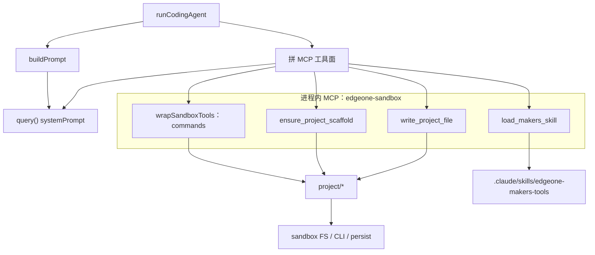

SDK 自带的 Read / Write / Bash 是关的（`tools: ['Skill']`）。模型不能直接碰宿主机；每一文件、每一条命令都走这个 MCP。平台知识不写进 prompt，避免和 vendored 文档各写一份。

### 9.1 Prompt 怎么管理

Prompt 分三层，**真正预先塞进模型的只有一层系统提示**。平台知识按需用工具加载；修构建错误用另一份**用户消息**，不再改 system。

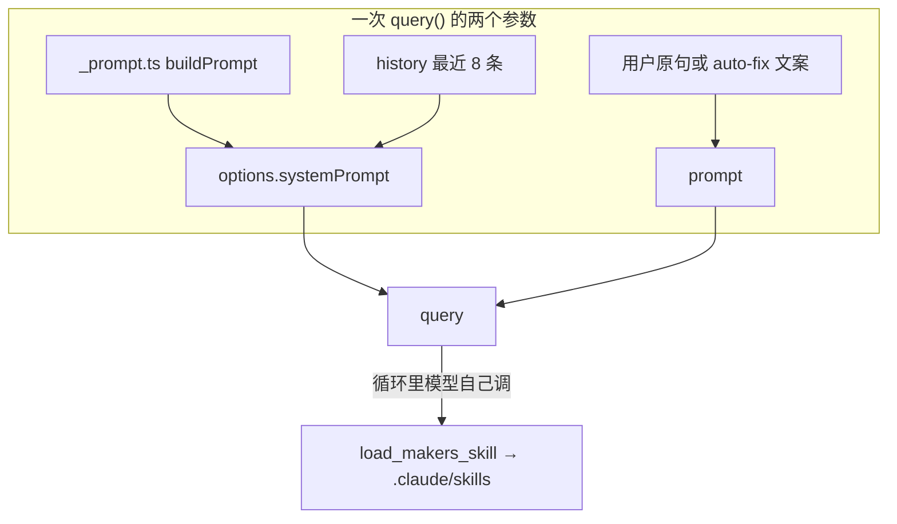

图上不要把「做项目」和「build 失败」看成 `query()` 内部的 if/else：

- **做项目 / 读 skill**：发生在 **这一轮** `for await` 里，模型调 `load_makers_skill`。
- **build 失败再修**：发生在 **`query()` 已经结束** 之后。Pipeline 跑 `runVerification`，失败才再调一次 `runCodingAgent`，第二次的 `prompt` 换成 `buildAutoFixPrompt`。

| 层 | 文件 | 进哪 | 写什么 |
|---|---|---|---|
| 沙箱规矩 | `agents/_prompt.ts` → `buildPrompt` | 每次 `query()` 的 `systemPrompt` | 人设、工具合同、preview/deploy 覆盖、旁白和终回复风格 |
| 平台知识 | `.claude/skills/edgeone-makers-tools/` | 不预置；模型用工具现读 | handler、KV、路由、SSE 协议等。官方 skill 写「本机开发」，被 `buildSandboxOverrides` 盖掉 |
| 这次构建错在哪 | `utils/_build-errors.ts` → `buildAutoFixPrompt` | **下一轮** `query()` 的 `prompt` | 原需求 + 摘要 + 12000 字日志 + 最多 12 个路径 |

Deploy / Resume 不进 `query()`，没有这三层。`tests/prompt-single-source.test.ts` 禁止 `buildPrompt` 里出现 `onRequestGet`、`context.env.KV`、`export function middleware` 等平台标识，避免和 skill 各写一份。

#### `buildPrompt` 拼装顺序

| 段 | 写什么 |
|---|---|
| IDENTITY | 人设：Makers 可部署的 Web Dev Agent；身份问答直接答、不调工具 |
| KNOWLEDGE_SOURCING | 平台知识只能 `load_makers_skill`；按需求选 skill（recipes / functions / agents / storage / middleware 等），同轮不要重复、独立 load 可并行，每轮最多再 load 2–3 份 `ref`；禁止用 SDK `Skill` 再调 router |
| `buildSandboxOverrides` | 无本地 Read/Write/Bash；禁止装 CLI / 传 token；preview 用指定 `makers dev`；deploy 仅用户明确要求时；禁止把 `/preview/` 写进 Vite `base`；浏览器 API 用 `new URL('api/…', location.href)` |
| 非项目拒绝 | 与做页面无关 → 固定一句，不调工具。身份问题走 IDENTITY |
| NARRATION | 先一句旁白，**第一个工具必须是** `ensure_project_scaffold` |
| 新项目 / 已有项目工作流 | `created=true`：load → 一次一个文件 → install → makers dev。`created=false`：最小改动 |
| `buildToolContracts` | path 相对 `appDir`；验证命令加 `EXIT:$?`；禁止手写 lockfile |
| CODE_QUALITY | 拆文件；`package.json` 必须有 `scripts.build`（纯静态用 `echo skip`） |
| FINAL_REPLY | 最多两句；禁止贴预览 URL；线上 deploy 成功则单独一行完整 URL |
| 上下文 | `isNewProject` 一句 + history 最近 8 条 + **当前用户原文** |

`userMessage` 会出现两次：一次在 system 末尾，一次作为 `query({ prompt })`。pipeline 已从 history 里 `pop` 掉当前这句 user。模型终回复出来后，宿主还会再压一遍（`compactUserFacingReply`、剥预览 URL），见第 7.3 节。

### 9.2 MCP 工具面怎么拼出来

全在 `runCodingAgent` 里，名字固定 `edgeone-sandbox`（`SANDBOX_MCP_SERVER_NAME`）。

1. `context.tools.toClaudeMcpServer('edgeone-sandbox', { alwaysLoad: true })` — Makers 提供的沙箱工具定义，不是 SDK 自带的。
2. 丢掉名字含 `browser` 的工具，以及 `files_write` / `write_files` / `__files_write`。通用写文件会绕过 path 白名单和 SSE 推送。
3. `wrapSandboxTools` 只包 `commands`（`shortenToolName === 'commands'`）。`files_read` / `files_list` / `makeDir` 等原样留下，但 prompt 要求优先 `write_project_file`。
4. 挂上三个 `tool()` 自定义工具。
5. `createSdkMcpServer` 绑成进程内 MCP。`allowedTools` + `strictMcpConfig`：名单外调不了。
6. SDK `skills: ['edgeone-makers-tools']` 只为列出官方 router；prompt 禁止再 `Skill` 调它。正文靠 `load_makers_skill`。

模型看见的名字是 `mcp__edgeone-sandbox__<tool>`。事件泵里脚手架匹配的是 `mcp__edgeone-sandbox__ensure_project_scaffold`。

### 9.3 三个自定义工具

都在 `agents/tools/`，用 SDK `tool()`（代码里叫 `defineClaudeTool`）+ Zod。

#### `ensure_project_scaffold`

无入参。`ensureProjectScaffold`：`makeDir` → `repairNestedAppDirLayout`（模型曾把 path 写成 `appDir/file`，真实文件落到 `appDir/appDir`；根上没有 `package.json` / `index.html` 时把嵌套树抬回来）→ `find` 一层。已有文件 → `{ created: false }`；空目录 → `{ created: true }`。无论哪边，`state.created = true`，并回调 `onResult` 置 `projectTouched`。

prompt 要求这是做项目时的第一枪。非首轮 Chat Pipeline 会把这次 tool_use/result 对 UI 藏掉，避免改需求时再闪一次脚手架。

#### `write_project_file`

`{ path, content }`，一次一个完整 UTF-8 文件。

1. `toAppRelPath`：必须相对 `appDir`。`projects/xxx/app/src/App.tsx` 或 `/…` 直接拒。
2. `getBlockedProjectWriteReason`：挡 `.env`、lockfile、`node_modules` / `.next` / `dist` 等段、二进制扩展名。
3. 先 `makeDir` 父目录，再 `sandbox.files.write`。
4. `onResult({ written, content })` → pipeline 推 `file_content`（96KiB / 2MiB 预算）并 `checkpoint.schedule`。

返回给模型的只有 `{ written }`，不是全文。失败 `isError: true`。

#### `load_makers_skill`

`skill` 是 10 值 enum：`makers-agents` / `recipes` / `cloud-functions` / `edge-functions` / `storage` / `middleware` / `cli` / `deploy` / `env-adaption` / `migration`。

- 无 `ref`：读该目录 `SKILL.md`，再扫 `references/**/*.md` 拼索引（进程内 cache）。模型没有列目录的工具，索引是发现更深文档的唯一入口。
- 有 `ref`：规范化掉 `references/` 前缀，`path.resolve` 后必须仍在该 skill 的 `references/` 下，否则当未知引用，列出可用列表，`isError: true`。

文件在 Agent 运行时磁盘上（`process.cwd()/.claude/skills/edgeone-makers-tools/references/<skill>/`），沙箱 MCP 的 `files_read` 到不了。所以不能用 Read，只能用这个工具。

### 9.4 `wrapSandboxTools`：模型打命令，宿主改写再执行

只包装 `commands`。模型传入的 `command` / `cmd` 先过 `forbiddenSandboxCommandReason`：

- 禁止 `npx edgeone`、传 `-t/--token`、login/link/乱改 env
- 除 `makers dev` / `makers deploy` / 只读 `edgeone --version` 外，禁止其它 `edgeone …`
- 禁止探测 AI Gateway、翻 `.edgeone`、打 Pages OpenAPI、改 `.curlrc`

过了之后：

| 模型以为自己在跑 | 宿主实际做的 |
|---|---|
| 普通验证命令 | `withExitCodeEcho` 追加 `; echo EXIT:$?`。`isError` 仍为 false，模型靠 EXIT:N 修源码 |
| `edgeone --version` | 换成只读 version 命令。127 或 CLI 缺失 → `MAKERS_CLI_UNAVAILABLE`，`retryable: false` |
| `makers dev` | `assertMakersProjectCompatible` → 签发短时 token → **丢掉模型写的 `-n`**，换成 `buildMakersDevBackgroundCommand`（8088 + 3000 剥前缀 + 强制项目名，cwd=`appDir`，timeout 120s）→ 解析退出码 → `publishRunningPreview`；热进程还是旧包则 `startPreviewServer` 再发一次 → `onPreviewReady` |
| `makers deploy` | 同样换项目名、注入 env、timeout 600s。先 `deployment_status: running`。解析 JSON **之后**才 `redactSecret`，避免 URL query 碰巧撞上 token 被裁掉。成功 → `onDeploymentStatus` + `{ status: 'published', url }` |

`MAKERS_CLI_UNAVAILABLE` 是终态：prompt 要求立刻停，不要 which / 装包 / 重试。

项目名：`MAKERS_DEPLOY_PROJECT_NAME` 若设置则全会话共用（运维钉死）；否则 `vibe-coding-` + `sha256(sessionDir).slice(0,10)`。不能用 conversationId 原文，部署后会进公开主机名。主 token `EDGEONE_PAGES_API_TOKEN` 只留在运行时，签发 900–86400s（默认 3600）的 tenant token；API 环境要和 CLI 的 `API_ENV` / region 对齐，否则沙箱只报 token invalid。

### 9.5 Vendored Skills

磁盘约 45 篇 md。SDK `skills` 只让模型看见官方 router；正文走 `load_makers_skill`（第 9.3 节）。这是知识不是执行，「本机跑 makers」被 `buildSandboxOverrides` 盖掉。

### 9.6 `project/*`：工具后面的沙箱适配

`agents/_project.ts` 只做再导出。工具和流水线都调这里，不直接散落 `context.sandbox`。

| 文件 | 谁用 | 做什么 |
|---|---|---|
| `_state.ts` | workspace / reset | 路径白名单、`createProjectState`、把误当 preview 的线上 URL 拆到 `deployment` |
| `_scaffold.ts` | 脚手架工具 + Chat 验证 | `ensureProjectScaffold`、`repairNestedAppDirLayout`、`runVerification` |
| `_fs.ts` | 写文件后推树、`/file`、resume | 文件树、读文本 |
| `_commands.ts` | 验证、install、包装后的 CLI | `runSandboxCommand` / `runCommandCapturingExit` |
| `_preview.ts` | commands wrap、resume | 8088 / 3000 / 9000、`publishRunningPreview`、`rewritePreviewAccessToken` |
| `_makers-token.ts` | commands wrap、Deploy | 主 token → 短时 tenant token、按 env/region 选 API |
| `_makers-deploy.ts` | 同上 | 会话级项目名 |
| `_makers-compat.ts` | 验证、dev/deploy 前 | skill frontmatter lint |
| `_persistence.ts` | workspace / resume / download | `sandbox.restore` / `persist`；legacy zip 迁移 |
| `_archive.ts` | download | 现场打包，排除 `node_modules` 等 |

`_memory.ts` 不在 `project/`，管的是 conversation metadata（`chatTask`、messages、`activityHistory`）。源码快照走 Blob，不进这段 metadata。Deploy 不进 MCP，见第 7.4 节。

---

## 10. `app/`：工作区 UI

`page.tsx` 是服务端壳，交互全在 `WorkspaceScreen`（约 1765 行）。不 import `agents/`，只 `fetch` 公开路由，类型从 `shared/protocol` 经 `app/types/workspace.ts` 再导出。

### 10.1 模块

| 文件 | 职责 |
|---|---|
| `features/workspace/workspace-screen.tsx` | 发任务、消费 SSE、resume、预览 token 续期（8 分钟）、停止 / 下载 / 部署 |
| `features/workspace/workspace-api.ts` | `startChatTask` / `fetchChatTaskStream` / `stopChatTask` / resume / download / transcript |
| `features/workspace/sse.ts` | `consumeEventStream`：拆帧；细节见第 6.4 节 |
| `components/agent-conversation.tsx` | 把 `AssistantActivity` 画成时间线 |
| `components/files-panel.tsx` | 文件树 + Prism；`makersFileSemantic` 徽标 |
| `lib/assistant-timeline.ts` | 连续 tool 收成一块；终回复与旁白去重 |
| `lib/tool-activity.ts` | 工具名映射为 Write file / Deploy 等；旁白重放去重（≥24 字） |
| `lib/conversation.ts` | `localStorage` 里的 `conversationId` |
| `hooks/use-file-content-cache.ts` | SSE 推送的文件正文，避免再打 `/file` |

请求头同时带 `conversationId` 和 `makers-conversation-id`。事件分叉见第 6.6 节。`buildAssistantTimeline`：text → tools → text；终回复与最后旁白相同则不再渲染，以旁白为前缀则只补后面。

### 10.2 刷新与请求

刷新接两条 SSE 的流程见第 6.5 节和 Resume 实现（第 7.5 节）。这里只补前端自己的数：iframe 每 8 分钟 `rewritePreviewAccessToken`；冷恢复客户端超时 620s。

### 10.3 前端发出的 body

- 生成：`POST /chat` `{ message, turnId, resetProject? }`
- 发布：同上 + `intent: 'deploy'`，message 可空
- 停止：`POST /stop` `{ conversation_id, turn, discardProject? }`；若运行时要求 body-only，去掉粘滞 header 再打一次

---

## 11. 预览与部署

两条通道，互不覆盖。

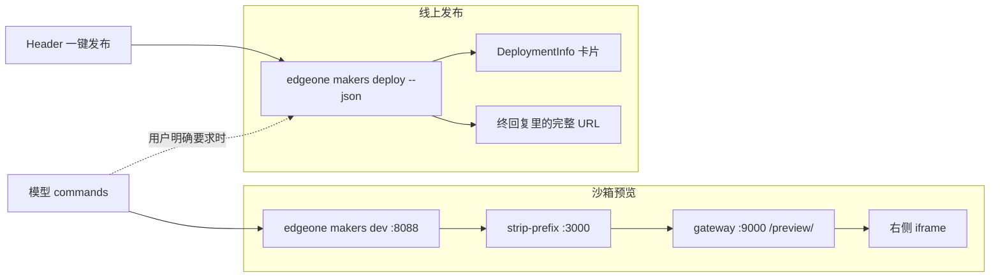

- 预览：`:8088` 站点根为 `/`；`:3000` 把 `/preview/*` 剥前缀；`/preview`（无尾斜杠）308 到 `/preview/` 且保留 `access_token`。生成代码禁止写 `/preview/` 当 Vite `base`，禁止 `fetch('/api/...')`，应写成 `new URL('api/example', location.href)` 再复制 query 里的 token。命令改写见第 9.4 节。
- 部署：不经过 SDK；不覆盖 `previewUrl`。模型禁止在气泡里贴预览 URL。线上地址只在本轮部署成功时写入终回复。发布流水线见第 7.4 节。

相关：`docs/template-transformation.md`（Skills 可达、prompt 瘦身、直连 CLI）。`tests/sse-parser.test.ts` 钉死拆帧、DONE 截断、`reader.cancel()`。

---

