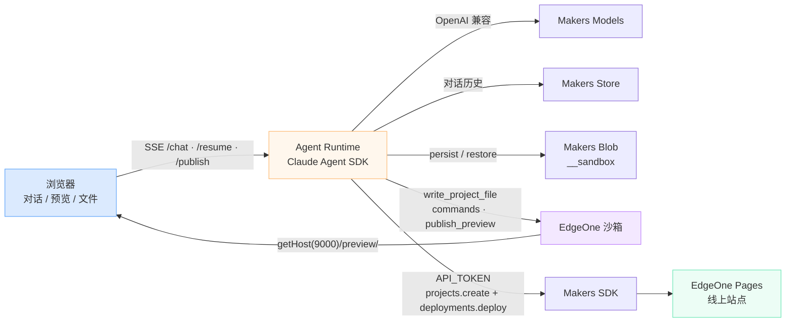

# Vibe Coding Agent 模板

Vibe Coding Agent 是一个基于 Claude Agent SDK 的开源 Vibe Coding 平台模板，深度集成 Makers 的沙箱、模型网关、Store、Blob 存储和 Makers SDK。开发者基于此模板可以快速搭建自己的 Vibe Coding 平台，支持多技术栈生成、沙箱实时预览，以及在沙箱外一键发布到边缘网络。

> **和 CLI 版模板的区别：** 本模板在 **Agent Runtime 内通过 Makers SDK** 打包并发布生成项目，沙箱只负责写代码、装依赖和启动预览。另一个模板 [`vibe-coding-agent-cli`](https://pages.edgeone.ai/templates/vibe-coding-agent-cli) 在沙箱内驱动 EdgeOne CLI（`edgeone makers dev` / `deploy`），预览与线上运行时一致。若希望生成任意 Web 技术栈、由运行时统一代发部署，使用本模板。

---

## 核心特性

**沙箱实时预览：** Agent 在会话级隔离沙箱中写文件、安装依赖，并调用 `publish_preview` 启动应用。预览走沙箱端口映射（内部 `3000` → 公网 `9000` + `/preview/`），右侧面板即时展示运行效果。预览地址仅在当前沙箱生命周期内有效。

**多技术栈开箱即用：** 按用户需求生成 Next.js、Vite/React、静态站点、Node 服务、Flask / FastAPI 等轻量 Web 项目，不强制单一框架。预览启动会按 `package.json` 与入口文件自动探测技术栈；发布前会剥离沙箱专用的 `/preview/` 路径前缀，避免线上资源 404。

**一键发布到边缘：** 右上角发布按钮不经过模型。Agent Runtime 从沙箱打包 zip，用 `@edgeone/makers-sdk` 创建按会话隔离的 Makers 项目并触发部署，返回可长期访问的 HTTPS 地址。部署区域根据站点根域名（`.dev` / `.cool`）判断，无需额外环境变量。

**多模型接入：** 通过 Makers Models 统一接入多个模型供应商，一个 API Key 即可调用全部内置模型，无需单独对接各厂商。支持通过环境变量追加自有模型，输入框可在运行时切换；不在目录中的模型会被服务端拒绝。

**会话与源码持久化：** 对话历史写入 Makers Store；源码检查点通过 `sandbox.persist()` 落到当前项目保留的 `__sandbox` Blob Store，归档字节不经过对话元数据。页面刷新后自动恢复对话、文件树和预览；沙箱回收后 `restore()` 拉回工作区并重装依赖。

**凭证不出沙箱：** `API_TOKEN` 只留在 Agent Runtime，用于 SDK 发布。沙箱与模型上下文看不到主 Token。预览使用运行时注入的沙箱访问令牌（`envdAccessToken`），随沙箱回收失效。每个会话对应独立项目名 `vibe-{conversationId}`，互不撞名。

**构建校验与自动修复：** 生成完成后，Node 项目执行 `npm run build`，Python 项目执行 `python -m compileall`。失败时流水线自动发起一轮修复，再决定是否展示预览。

**文件浏览与源码导出：** 右侧代码面板按文件树浏览生成源码，`/file` 按需读取文本文件。支持打包下载工作区（排除 `node_modules`、构建产物等，上限 60MB）。

---

## 整体架构

浏览器通过 SSE 连接 Agent Runtime。Agent Runtime 调用模型网关编排工具循环，通过沙箱 MCP 在隔离环境中写代码并发布预览；用户确认后，Runtime 读取沙箱产物，用主 Token 调用 Makers SDK 部署到边缘。



两条链路不要混用：

| 链路 | 触发 | 产物 | 生命周期 |
|------|------|------|----------|
| **沙箱预览** | Agent 调用 `publish_preview` | 临时公网预览 URL | 随沙箱回收失效（默认 30 分钟） |
| **正式发布** | 用户点击发布 | 按会话创建的 Makers 项目 + 线上地址 | 长期有效，归属平台方 Token 下的独立项目 |

---

## 已实现的功能

### Agent 运行

- **Claude Agent SDK 循环：** Prompt 编排 → 模型调用 → 沙箱工具执行 → 结果回写。工具集限制在沙箱 MCP，`permissionMode: dontAsk`。
- **增量写文件：** 自定义工具 `write_project_file` 按文件逐个写入，进度持续推到前端，不一次倾倒整个项目。
- **会话路由：** 相同 `Makers-Conversation-Id` 复用同一运行时实例和沙箱工作区；首页新请求可设 `resetProject: true` 重建项目。
- **SSE 与重连：** `POST /chat` 在同一响应中流式返回状态、日志、工具、文件、预览和最终回复。刷新后 `GET /chat?runId=...` 重连任务，`GET /resume` 恢复工作区并预热文本文件。
- **中止当前轮次：** `POST /stop` 取消正在执行的生成。

### 沙箱预览

- **自动探测启动命令：** Next / Vite / Astro / Nuxt / SvelteKit / 通用 `npm run dev`、Flask、FastAPI、静态 `http.server`。
- **就绪探测：** 等待 `/preview/` HTTP 就绪后再返回公网地址；已就绪则复用进程，避免每轮重启。
- **预览配置注入：** Vite / Next 的 host、port、HMR、`basePath` 由模板按沙箱约定处理，业务代码不必手写 `/preview`。

### SDK 发布

- **Runtime 代发：** 打包沙箱工作区 → 改写预览路径 → `makers.projects.create`（按会话）→ `makers.deployments.deploy`（等待完成并回传状态）。
- **区域推断：** `.dev` 走国际站 + 海外加速，`.cool` 及其他域名走国内站。
- **能力降级：** 未配置 `API_TOKEN` 时仍可生成与预览，发布入口提示补齐 Token，不阻断主流程。

### 安全边界

- 主 API Token 仅存在于 Runtime 环境变量，不进入沙箱、不进入模型上下文、不下发前端。
- 沙箱实例按会话隔离，超时由 `agents.sandbox.timeout` 控制。
- 模型选择服务端校验：请求里的模型 ID 必须落在当前部署的目录中。

---

## 快速开始

安装依赖并配置环境变量：

```bash
npm install
cp .env.example .env
```

在 `.env` 中填入以下必填变量（获取方式见 [Makers Models](https://cloud.tencent.com/document/product/1552/132748)）：

| 变量 | 说明 |
|------|------|
| `AI_GATEWAY_API_KEY` | Makers Models API Key，或任意 OpenAI 兼容供应商 Key |
| `AI_GATEWAY_BASE_URL` | 网关地址，Makers Models 填 `https://ai-gateway.edgeone.link/v1` |
| `API_TOKEN` | Makers API Token，用于一键发布。仅发布需要，生成和预览可不填 |

安装 EdgeOne CLI 并启动本地开发：

```bash
npm i -g edgeone
edgeone makers dev           # http://localhost:8088
```

打开 `http://localhost:8088/agent-metrics` 查看本地可观测面板。

也可从模板库一键创建：

```bash
edgeone makers create --template vibe-coding-agent
```

或在控制台使用 [部署到 EdgeOne Makers](https://console.cloud.tencent.com/edgeone/makers/new?template=vibe-coding-agent&from=within&fromAgent=1&agentLang=typescript)。

---

## 环境变量（可选）

| 变量 | 默认值 | 说明 |
|------|--------|------|
| `AI_GATEWAY_MODEL` | `@makers/deepseek-v4-flash` | 默认模型，同时是选择器初始选项。 |
| `AI_GATEWAY_EXTRA_MODELS` | — | 追加厂商模型，`id\|展示名` 逗号分隔。例如 `deepseek/deepseek-v4-pro\|DeepSeek V4 Pro`。 |
| `WEB_DEV_AGENT_DEBUG` | `false` | 设为 `true` 或 `1` 时启用脱敏的服务端调试日志。 |

内置模型（DeepSeek V4 Flash / Pro、混元 3、MiniMax、Kimi 等）免费但有额度限制，适合验证。生产环境请在控制台绑定自有供应商 Key（BYOK）。Agent 优先读取 `AI_GATEWAY_*`，必要时也可使用 Anthropic / DeepSeek 兼容兜底变量。

---

## 技术栈

| 层 | 技术 |
|----|------|
| 前端 | Next.js 16 + React 19 + Tailwind CSS 4 |
| Agent | Claude Agent SDK + EdgeOne 沙箱 MCP + 自定义 `write_project_file` / `publish_preview` |
| 模型 | Makers AI Gateway（OpenAI 兼容），支持多供应商 |
| 发布 | `@edgeone/makers-sdk`（Runtime 内创建项目并部署） |
| 平台 | EdgeOne Makers（Agent 运行时、沙箱、Store、Blob） |
| 持久化 | Makers Store + Makers Blob |

---

## 资源

- [Makers Agents 文档](https://cloud.tencent.com/document/product/1552/132759)
- [Agent 开发快速开始](https://cloud.tencent.com/document/product/1552/132786)
- [Makers Models](https://cloud.tencent.com/document/product/1552/132748)
- [Makers SDK](https://www.npmjs.com/package/@edgeone/makers-sdk)
- [模板仓库](https://pages.edgeone.ai/templates/vibe-coding-agent)
